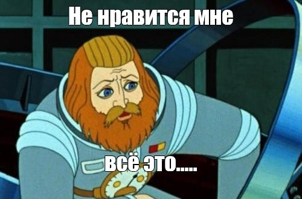

### Лабораторные работы несчастного страдальца 
**Слеповичева Святослава Ивановича**
группы 6405

### Научный руководитель
**Дегтярев Сергей Александрович**

### Тема диплома
"Проект ПО для моделирования освещения интерьера с использованием технологии трассировки лучей"

### Любимая цитата
>**"Ну? Что у нас плохого?"**

Капитан Зелёный "Тайна третьей планеты"

#### Бессилие
С загрузкой на Github приходит осознание, что здесь не работают markdown файлы, как в Obsidian :'(

#### Про мою ситуацию
Искренне прошу прощения, что не смог успеть нормально заниматься на протяжении всего семестра,
на то были свои серьёзные причины, плоды которых падают на меня до сих пор.
Но я исправляюсь и стараюсь справиться со всем.

Скажу только ещё одну любимую цитату:
>"Не страшно, если ты в депрессии, зарылся в самокопании или самобичевании. Страшно, если тебя оттуда некому вытащить"

Один студент, который старается изо всех сил

## Лабораторная Работа 2

Цель лабораторной работы: изучение основ HTML и CSS.
Задание на программирование: разработать многостраничный web-сайт на произвольно выбранную тему с использованием технологий HTML и CSS, загрузить проект в репозиторий.
Требования к web-сайту:
1.	Количество страниц – от 3 до 5.
2.	Требования к HTML:
2.1.	Использование блочных и строчных элементов.
2.2.	Ссылки – от 1 шт.
2.3.	Картинки – от 1 шт.
2.4.	Таблица – от 1 шт.
3.	Требование к CSS:
3.1.	Отдельный подключаемый файл.
3.2.	Обязательное использование как минимум 3 видов селекторов.
3.3.	Использование цвета.
3.4.	Использование различных видов выравнивания в таблице (по левому/правому краю и по центру).
4.	Запрещено использовать JS, Bootstrap и любые другие библиотеки и фреймворки, всё реализовать самостоятельно.

## Лабораторная работа 4
Цель лабораторной работы: изучение современного CSS, обработки событий на JavaScript и асинхронности.
Задание на программирование: модернизировать web-сайт из лабораторной работы №2 с использованием технологий HTML, CSS и JavaScript, и загрузить проект в репозиторий.

Требования к web-сайту:
1.	Вёрстка с помощью Flexbox – 1 страница.
2.	Вёрстка с помощью Grid – 1 страница.
3.	Реализация анимации (красивой!) с помощью CSS – 1шт.
4.	Реализация формы с отправкой POST-запроса на сервер по нажатию кнопки (без обработки на серверной стороне).
5.	Проверка введённых данных с использованием событийной модели JavaScript.
6.	Реализация асинхронного запроса на сервер для получения данных (например, для заполнения одной из таблиц) с обязательной обработкой возможных ошибок.

Порядок выполнения работы:
0.	Выполнить слияние предыдущих лабораторных в master-ветку (через pull-request).
1.	Создать отдельную ветку lab4 в репозиторий для лабораторных работ.
2.	Дополнить файл Readme.md описанием лабораторной №4.
3.	Создать папку lab4.
4.	Реализовать web-сайт в соответствии с заданием.
5.	Выполнить слияние в master-ветку.

